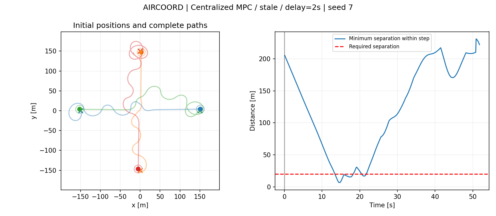
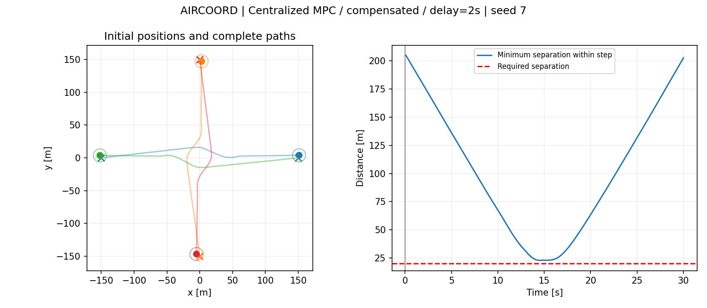

# AIRCOORD

### Delayed-State Compensation for Multi-Vehicle Coordination with Centralized MPC

AIRCOORD is a simulation study of **multi-vehicle coordination under delayed state information and model uncertainty**.

I developed the project to investigate a simple question:

> **How much does delayed state information degrade cooperative trajectory control, and can part of that degradation be recovered using the history of previously issued control commands?**

The system consists of multiple vehicles crossing a shared 2D airspace. A centralized nonlinear Model Predictive Controller (MPC) coordinates their trajectories while attempting to maintain pairwise separation.

Three information conditions are compared:

* **Current:** the controller receives the current vehicle states.
* **Stale:** the controller receives delayed vehicle states directly.
* **Compensated:** delayed states are propagated forward by replaying the control commands issued since the measurement timestamp.

To prevent the compensation method from simply reconstructing the simulator exactly, the plant is also subjected to **unobserved acceleration disturbances** that are not included in the controller model.

---

## Main Result

The effect of delayed information becomes particularly visible at a **2.0 s reporting delay**.

With an acceleration disturbance standard deviation of **0.3 m/s²**:

| State information | Episodes with separation violation | Vehicle arrival rate | Worst separation |
| ----------------- | ---------------------------------: | -------------------: | ---------------: |
| Current           |                             0 / 10 |                 100% |         22.896 m |
| Stale             |                         **7 / 10** |              **60%** |      **3.980 m** |
| Compensated       |                         **0 / 10** |             **100%** |     **22.685 m** |

The required separation distance is **20 m**.

These results suggest that directly using sufficiently delayed states can severely degrade coordination, while propagating those states using known command history can recover much of the lost performance in this scenario.

The result is empirical and specific to the simulated conditions; it is **not a formal safety guarantee**.

---

## Representative Trajectories

The following example uses:

* 4 vehicles
* seed 7
* 2.0 s state-report delay
* acceleration disturbance standard deviation of 0.3 m/s²

### Stale state information

The controller acts directly on delayed state reports.

A separation violation occurs, and only 3 of the 4 vehicles reach their goals within the simulation horizon.



### Command-replay compensation

The same delayed measurement is propagated forward using the commands issued since the measurement was generated.

No separation violation is observed in this episode and all four vehicles reach their goals.



---

## Problem Setup

Each vehicle is represented by the planar state

$$
\mathbf{x}
=
\begin{bmatrix}
x \\
y \\
v \\
\psi
\end{bmatrix}
$$

where:

* $x$ and $y$ are position,
* $v$ is speed,
* $\psi$ is heading.

The control input is

$$
\mathbf{u}
=
\begin{bmatrix}
a \\
\omega
\end{bmatrix}
$$

where:

* $a$ is longitudinal acceleration,
* $\omega$ is heading rate.

The default simulation uses:

| Parameter               |  Value |
| ----------------------- | -----: |
| Number of vehicles      |      4 |
| Simulation step         |  0.1 s |
| Maximum simulation time |   60 s |
| Nominal cruise speed    | 10 m/s |
| Maximum speed           | 15 m/s |
| Maximum acceleration    | 2 m/s² |
| Maximum turn rate       |  30°/s |
| Required separation     |   20 m |
| MPC separation target   |   23 m |
| MPC prediction horizon  |    5 s |
| MPC control blocks      |      5 |

Vehicles start approximately uniformly distributed around a circle and are assigned goals on the opposite side, producing intersecting trajectories through a common conflict region.

---

## Controller

### Nominal Goal-Tracking Policy

A simple goal-tracking controller generates nominal acceleration and heading-rate commands.

This controller attempts to move each vehicle toward its destination but does not explicitly coordinate with the other vehicles.

The nominal policy therefore serves as the reference command for the MPC coordination layer.

### Centralized Nonlinear MPC

The coordination controller jointly optimizes the commands of all active vehicles.

At every control step, the MPC predicts the trajectories of the vehicles over a finite horizon and modifies the nominal commands when predicted pairwise separation becomes too small.

The optimization balances:

1. deviation from the nominal goal-tracking commands,
2. control smoothness,
3. separation-constraint slack.

The separation condition can be written conceptually as

$$
d_{ij}(k) \geq d_{\mathrm{sep}} - s_{ij}(k),
$$

where:

* $d_{ij}$ is the predicted distance between vehicles $i$ and $j$,
* $d_{\mathrm{sep}}$ is the desired separation distance,
* $s_{ij} \geq 0$ is a slack variable.

The separation constraint is therefore implemented as a **soft constraint**, allowing the optimization problem to remain feasible when the desired separation cannot be maintained.

The optimization is solved using **SciPy SLSQP**.

Only the first control action of the optimized sequence is applied before the problem is solved again at the next simulation step.

Both cold initialization and shifted warm initialization are supported.

---

## Delayed-State Model

State reports can arrive with a configurable delay.

For the stale-information case,

$$
\hat{\mathbf{x}}_k = \mathbf{x}_{k-d},
$$

where $d$ is the reporting delay expressed in simulation steps.

The controller therefore makes its decision using information describing the system at an earlier point in time.

For sufficiently large delays, the difference between the delayed state

$$
\mathbf{x}_{k-d}
$$

and the actual current state

$$
\mathbf{x}_k
$$

can become large enough to produce inaccurate trajectory predictions and poor coordination decisions.

---

## Command-Replay Compensation

The compensated controller begins with the same delayed state report but also uses the sequence of control commands issued after that report was generated.

Starting from

$$
\hat{\mathbf{x}}_{k-d} = \mathbf{x}_{k-d},
$$

the stored commands are replayed through the controller's internal vehicle model:

$$
\hat{\mathbf{x}}_{t+1}
=
f\left(
\hat{\mathbf{x}}_t,
\mathbf{u}_t
\right),
\qquad
t = k-d,\ldots,k-1.
$$

This produces an estimate of the current state,

$$
\hat{\mathbf{x}}_k,
$$

which is then supplied to the MPC instead of the original stale measurement.

Conceptually,

$$
\mathbf{x}_{k-d}
\xrightarrow{
\mathbf{u}_{k-d},\ldots,\mathbf{u}_{k-1}
}
\hat{\mathbf{x}}_k.
$$

This method is intentionally simple. It does not estimate unknown disturbances and does not use hidden simulator state.

Its purpose is to isolate how much useful information can be recovered purely from **timestamped measurements, known dynamics, and previously issued commands**.

---

## Model Mismatch

A perfect command replay would be uninteresting if the controller and plant were identical.

To introduce model mismatch, the simulated plant experiences an additional acceleration disturbance:

$$
a_{\mathrm{actual}}
=
a_{\mathrm{command}}
+
w,
$$

where

$$
w \sim \mathcal{N}(0,\sigma_a^2).
$$

The disturbance is applied only to the simulated plant.

The controller does not observe $w$, and the compensation model therefore cannot reproduce the true trajectory exactly.

A separate seeded random stream is used for the disturbance so that controller configurations can be compared under consistent disturbance realizations.

---

## Safety Metric

Pairwise separation is evaluated throughout each simulation transition rather than only at the discrete simulation states.

For two vehicles moving linearly between consecutive simulation samples, the minimum distance along the two segments is computed.

An episode is marked as containing a separation violation if

$$
d_{ij} < 20\ \mathrm{m}
$$

for any active vehicle pair at any point during the episode.

The MPC itself targets a slightly larger distance:

$$
d_{\mathrm{target}} = 23\ \mathrm{m}.
$$

This provides a **3 m planning margin** before separation slack is introduced.

---

## Experiment Design

The main experiment compares three state-information modes:

* current
* stale
* compensated

under three nominal report delays:

* 0.5 s
* 1.0 s
* 2.0 s

Each condition is evaluated using seeds **7–16**.

The experiment grid therefore contains

$$
3 \times 3 \times 10 = 90
$$

simulation records.

The same scenario seeds are reused across controller conditions to make the comparisons more meaningful.

The current-state controller always receives zero-age state information. Its repeated rows across the three nominal delay settings therefore represent the same information condition and should not be interpreted as independent delay experiments.

---

## Experimental Results

| Delay | State source | Violation episodes | Arrival rate | Worst separation | Failed solver calls |
| ----: | ------------ | -----------------: | -----------: | ---------------: | ------------------: |
| 0.5 s | Current      |               0/10 |       100.0% |         22.896 m |                   1 |
| 0.5 s | Stale        |               0/10 |       100.0% |         21.399 m |                  10 |
| 0.5 s | Compensated  |               0/10 |       100.0% |         22.938 m |                   1 |
| 1.0 s | Current      |               0/10 |       100.0% |         22.896 m |                   1 |
| 1.0 s | Stale        |               0/10 |        97.5% |         23.692 m |                  26 |
| 1.0 s | Compensated  |               0/10 |       100.0% |         22.865 m |                   0 |
| 2.0 s | Current      |               0/10 |       100.0% |         22.896 m |                   1 |
| 2.0 s | Stale        |           **7/10** |    **60.0%** |      **3.980 m** |                  34 |
| 2.0 s | Compensated  |           **0/10** |   **100.0%** |     **22.685 m** |                   1 |

### Interpretation

At **0.5 s**, all three approaches maintain separation in the tested episodes.

At **1.0 s**, stale information begins to affect efficiency and solver behavior, although no separation violations are observed.

At **2.0 s**, stale-state control deteriorates sharply. Seven of ten episodes contain a separation violation and the vehicle arrival rate falls to 60%.

Command-replay compensation substantially reduces this degradation in the tested scenarios, producing behavior close to the current-state reference despite the controller not observing the plant acceleration disturbances.

---

## Solver Diagnostics

In addition to trajectory-level metrics, AIRCOORD records optimization diagnostics at every control step, including:

* number of solver calls,
* rejected solver solutions,
* number of MPC interventions,
* maximum separation slack,
* warm-start usage,
* solver iterations,
* objective evaluations,
* decision time.

A failed optimization call does **not** automatically imply a separation violation.

If a candidate optimization result is rejected, the controller applies a braking fallback while retaining the nominal heading-rate command.

This fallback is designed to keep the simulation well-defined but is not guaranteed to maintain separation.

---

## Quick Start

Python 3.10 was used for the current implementation.

Clone the repository and create an environment:

```bash
git clone https://github.com/eminuluisik/aircoord.git
cd aircoord

python -m venv .venv
```

Activate the environment.

### Windows PowerShell

```powershell
.venv\Scripts\Activate.ps1
```

### Linux / macOS

```bash
source .venv/bin/activate
```

Install the dependencies:

```bash
python -m pip install -r requirements.txt
```

Run the tests:

```bash
python -m unittest discover -s tests -v
```

---

## Run a Single Simulation

### Goal-tracking baseline

```bash
python aircoord.py \
    --controller baseline \
    --seed 7 \
    --out results/baseline \
    --gif
```

### MPC with current states

```bash
python aircoord.py \
    --controller mpc \
    --initialization warm \
    --state-source current \
    --delay 2 \
    --accel-noise-std 0.3 \
    --seed 7 \
    --out results/current
```

### MPC with stale states

```bash
python aircoord.py \
    --controller mpc \
    --initialization warm \
    --state-source stale \
    --delay 2 \
    --accel-noise-std 0.3 \
    --seed 7 \
    --out results/stale
```

### MPC with command-replay compensation

```bash
python aircoord.py \
    --controller mpc \
    --initialization warm \
    --state-source compensated \
    --delay 2 \
    --accel-noise-std 0.3 \
    --seed 7 \
    --out results/compensated \
    --gif
```

MPC simulations can run considerably slower than simulated time because a nonlinear optimization problem may be solved repeatedly during the episode.

---

## Inspect a Single MPC Optimization

A single optimization call can be inspected without completing an entire MPC episode:

```bash
python aircoord.py \
    --inspect-mpc \
    --inspect-at 10 \
    --initialization warm \
    --state-source compensated \
    --delay 2 \
    --accel-noise-std 0.3 \
    --out results/inspection
```

This is useful for examining the optimization objective, predicted minimum separation, slack, solver iterations, and returned control action.

---

## Reproduce the Experiment Grid

Run all experiment conditions with:

```bash
python scripts/run_experiments.py
```

To preserve existing results, specify another output directory:

```bash
python scripts/run_experiments.py --out results/new_grid
```

To inspect the experiment commands without executing them:

```bash
python scripts/run_experiments.py --dry-run
```

The full grid contains 90 simulation runs and may require substantial computation time.

---

## Regenerate the Summary

The aggregate result table can be regenerated from the saved experiment records without rerunning the simulations:

```bash
python scripts/summarize_evidence.py
```

This separates expensive simulation runs from lightweight analysis and makes the reported results easier to reproduce.

---

## Output Files

A normal run stores the simulation outputs in a dedicated result directory.

Depending on the selected options, these include:

```text
metrics.json
diagnostics.csv
trajectory.npz
overview.png
replay.gif
```

### `metrics.json`

Episode-level performance metrics such as:

* arrival rate,
* minimum separation,
* violating pairs,
* mean arrival time,
* path length,
* solver statistics.

### `diagnostics.csv`

Step-by-step controller and optimization diagnostics.

### `trajectory.npz`

Numerical trajectory data for further analysis.

### `overview.png`

Static trajectory and separation visualization.

### `replay.gif`

Optional animation of the simulated episode.

---

## Repository Structure

```text
aircoord/
│
├── aircoord.py
│   Main simulator, controllers, MPC, compensation logic and visualization
│
├── scripts/
│   ├── run_experiments.py
│   └── summarize_evidence.py
│
├── tests/
│   └── test_core.py
│
├── evidence/
│   Saved experiment summaries
│
├── assets/
│   Figures used in this README
│
├── docs/
│   Additional technical and reproducibility notes
│
├── AIRCOORD_Report.pdf
│   Technical report
│
├── requirements.txt
└── README.md
```

---
---

## Future Work

AIRCOORD provides a baseline for several extensions:

* decentralized or distributed coordination,
* time-varying and stochastic communication delays,
* packet loss and asynchronous state updates,
* probabilistic state estimation,
* uncertainty-aware MPC,
* robust or chance-constrained safety formulations,
* larger and more heterogeneous traffic scenarios,
* learning-based multi-agent coordination,
* comparison between model-based prediction and learned state prediction,
* real-time optimization and hardware-in-the-loop evaluation.

A particularly interesting direction is to study how **model-based prediction and learning-based decision making can be combined when agents operate with incomplete, delayed, or uncertain information**.
